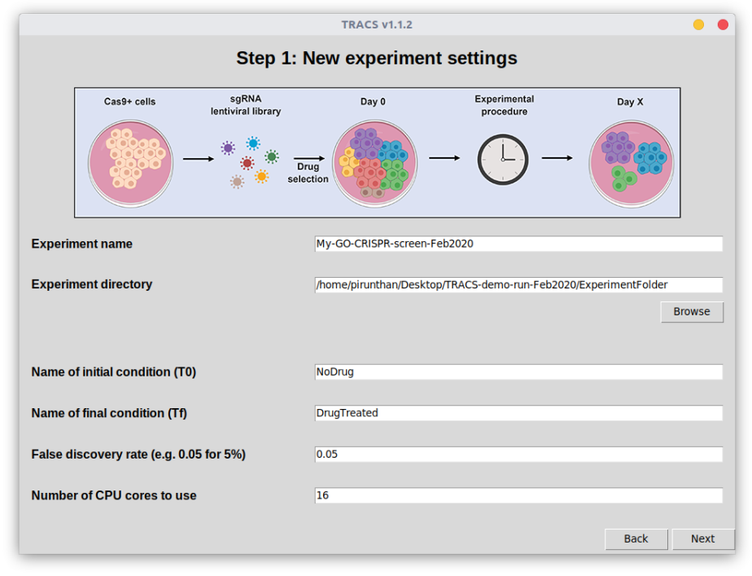
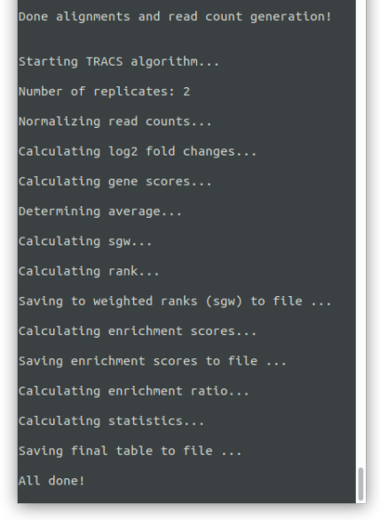
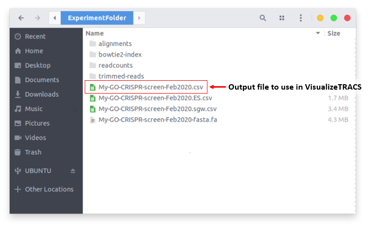

# TRACS
**T**oolset for the **R**anked **A**nalysis of **C**RISPR **S**creens - a GUI tool to analyze CRISPR screens

# Introduction
TRACS is a GUI (graphic user interface) based tool to analyze CRISPR screens. TRACS uses a ranking algorithm to identify sgRNAs and their respective genes that dropout or become enriched in experimental conditions. It requires you to provide sequencing data for a negative control conditon (cells tha do not express Cas9) and from the initial library preparation (plasmid preparation). 

Data output from TRACS can be visualized using the companion app, [VisualizeTRACS](https://github.com/developerpiru/VisualizeTRACS).

---

# Table of contents
+ [Using TRACS with Docker](https://github.com/developerpiru/TRACS#using-tracs-with-docker)
	+ [Docker on Windows](https://github.com/developerpiru/TRACS#docker-on-windows)
	+ [Docker on Mac OS](https://github.com/developerpiru/TRACS#docker-on-mac-os)
	+ [Docker on Linux](https://github.com/developerpiru/TRACS#docker-on-linux)
+ [Demo files](https://github.com/developerpiru/TRACS#demo-files)
+ [Analysis tutorial](https://github.com/developerpiru/TRACS#analysis-tutorial)
	+ [Step 1: Starting a new analysis](https://github.com/developerpiru/TRACS#step-1-starting-a-new-analysis)
	+ [Step 2: Loading library files and Cas9-positive read files](https://github.com/developerpiru/TRACS#step-2-loading-library-files-and-cas9-positive-read-files)
	+ [Step 3: Loading Cas9-negative read files](https://github.com/developerpiru/TRACS#step-3-loading-cas9-negative-read-files)
	+ [Step 4: Run TRACS analysis](https://github.com/developerpiru/TRACS#step-4-run-tracs-analysis)
	+ [Step 5: Data visualization and exploration](https://github.com/developerpiru/TRACS#step-5-data-visualization-and-exploration)
---


## Using TRACS with Docker

Connect to the desktop of your Windows, Linux or Mac OS device. You need to connect remotely to the desktop if you are using a remote\cloud server ([see instructions above](https://github.com/developerpiru/TRACS#install-on-headlessremotecloud-server)).

- [Docker on Windows](https://github.com/developerpiru/TRACS#docker-on-windows)
- [Docker on Mac OS](https://github.com/developerpiru/TRACS#docker-on-mac-os)
- [Docker on Linux](https://github.com/developerpiru/TRACS#docker-on-linux)

### Docker on Windows
#### Installation
1. Download and install Docker Desktop for Windows 10 Pro\Enterprise here: https://www.docker.com/products/docker-desktop

	If you have an older version of Windows (or Windows 10 Home) you will need to install Docker Toolbox: https://docs.docker.com/toolbox/toolbox_install_windows/

	Follow the instructions on the respective Docker pages for installing Docker and getting it running.

2. Download and install XMing X Server for Windows: https://sourceforge.net/projects/xming/
	
	Install with the default options.

3. Download the [TRACS-docker-launcher-windows.zip](TRACS-Docker-setup/TRACS-docker-launcher-windows.zip) file located in the TRACS-Docker-Setup folder on our github repository. 
	
	This contains the launcher for TRACS, XMing configuration, and Windows PowerShell scripts to automate setup and launching TRACS. 

4. Extract the TRACS-docker-launcher-windows folder. 

5. Right click the "Launch TRACS.ps1" file and click "Run with PowerShell". 
	Wait for the process to complete; it may take several minutes.
	The script will pull the latest TRACS image from Docker, use the XMing configuration script, and launch the TRACS interface.
	Approve the Windows access control prompt if necessary and approve the sharing of your local ```C:\``` if prompted by Docker.

TRACS will launch from the Docker container and mount your local ```C:\``` drive at ```/app/TRACS/cdrive/``` in the Docker container so you can transport files from the container to your local drive. 

**IMPORTANT!:** As with any Docker container, anything you DO NOT save in ```/app/TRACS/cdrive/``` will be lost when you exit TRACS!

---
### Docker on Mac OS
#### Installation
1. Download and install Docker Desktop for Mac OS here: https://www.docker.com/products/docker-desktop

	If you have an older version of Mac OS  you will need to install Docker Toolbox: https://docs.docker.com/toolbox/toolbox_install_mac/

	Follow the instructions on the respective Docker pages for installing Docker and getting it running.

2. Download and install XQuartz for Mac OS: https://www.xquartz.org/
	
	Install with the default options.

3. Start XQuartz and go to Preferences > Security and check option to allow connections from network clients. 
	
	Exit XQuartz.

4. Download the [Start-TRACS-MacOS](TRACS-Docker-setup/Start-TRACS-MacOS) file located in the TRACS-Docker-Setup folder on our github repository. 

5. Double click the "Start-TRACS" file to start the Docker container and launch TRACS.
	Wait for the process to complete; it may take several minutes.
	The script will pull the latest TRACS image from Docker, use the XMing configuration script, and launch the TRACS interface.

TRACS will launch in a Docker container and mount your local drives (```/Volumes```) at ```/app/TRACS/LocalDrives/``` in the Docker container so you can transport files from the container to your local drive. 

**IMPORTANT!:** As with any Docker container, anything you DO NOT save in ```/app/TRACS/LocalDrives/``` will be lost when you exit TRACS!

---
### Docker on Linux
#### Installation
1. Install Docker for Linux (Ubuntu):
	```
	sudo apt-get update
	sudo apt-get install docker.io
	```
	
2. Start Docker:
	```
	sudo systemctl start docker
	sudo systemctl enable docker
	
	```

5. Open a terminal window and enter this command to start the TRACS container:

	docker run -ti --rm -e DISPLAY=$DISPLAY -v /tmp/.X11-unix:/tmp/.X11-unix ubuntu -v /path/to/folder:/app/TRACS/sharedfolder pirunthan/tracs:latest

			
Where ```/path/to/folder``` is your local drive/folder that you want to make available to the TRACS container.
	
For example:
	
	docker run -ti --rm -e DISPLAY=$DISPLAY -v /tmp/.X11-unix:/tmp/.X11-unix ubuntu -v $HOME/:/app/TRACS/sharedfolder pirunthan/tracs:latest
	

TRACS will launch in a Docker container and mount your local drive or folder (```/path/to/folder```) at ```/app/TRACS/sharedfolder/``` in the Docker container so you can transport files from the container to your local drive.

**IMPORTANT!:** As with any Docker container, anything you DO NOT save in ```/app/TRACS/sharedfolder/``` will be lost when you exit TRACS!

---

# Demo files

Check the [Demo-files.md](Demo-files.md) file for information on how to download some demo files for testing TRACS.

---

# Analysis tutorial

Here we will walk through the steps to run a typical analysis using TRACS. This assumes you have already installed and launched TRACS using one of the methods described above in the [Installation methods](https://github.com/developerpiru/TRACS#installation-methods) section.

You can download some [demo files](https://github.com/developerpiru/TRACS#demo-files) above to test out TRACS and follow along.

A typical analysis can take 2-6 hours (or more) depending on how powerful your computer/server is, the number of samples you have, and the sequencing depth/number of reads. However, once you select all of your files and start the process, TRACS does everything automatically so you don't need to monitor it.

## Step 1: Starting a new analysis

1. Follow the instructions above to install and launch TRACS according to your desired method.
2. In the main TRACS window, click on ```Start New Experiment```.
3. You will be presented with Step 1 of the experiment wizard shown below:
	
4. Here you need to define the following:
	+ ```Experiment name```: Enter an identifying name for your project. All of the files created by TRACS will have this name as the prefix.
	+ ```Experiment directory```: Entire a folder to store all of the files created by TRACS. It is recommended that you make a new folder to keep things organized. TRACS will create subdirectories and files within this main folder.
	+ ```Name of initial condition (T0)```: Enter a name for your initial condition at time T0 (e.g. Initial, Adherent, Time_0hr, DMSO). This will be used as the column prefix for all initial condition (T0) samples. Do not use spaces!
	+ ```Name of final condition (Tf)```: Enter a name for your final condition at time Tf (e.g. Final, Spheroids, Time_48hr, Drug_treated). This will be used as the column prefix for all final condition (Tf) samples. Do not use spaces!
	+ ```False discovery rate (FDR)```: Enter a false discovery rate as a decimal fraction. The default is 0.05 for 5%.
	
5. Cick ```Next``` to continue.

## Step 2: Loading library files and Cas9-positive read files

6. You will then be presented with the next step of the wizard:
	
7. Here you must provide the following:
	+ ```Library reference file (CSV)```: This is the reference file in csv (comma-delimited) format containing all of the sgRNA IDs and sequences for your pooled sgRNA library. For the GeCKO v2 library, you can download this from our GitHub repository in the [```Resources```](Resources/) folder.
	+ ```Initial library (L0) read file (FASTQ)```: This is the sequencing read file of your initial pooled sgRNA library (L0). 
	+ ```Initial condition (T0) Cas9-positive read files```: Here you select load all of the read files for your Cas9-positive initial condition samples. Use the ```Add``` button to open the file selection dialog. You can select multiple files at once. Use the ```Remove``` or ```Clear``` buttons to remove files.
	
	+ ```Final condition (Tf) Cas9-positive read files```: Here you select load all of the read files for your Cas9-positive final condition samples.

8. Cick ```Next``` to continue.

## Step 3: Loading Cas9-negative read files

9. You will then be presented with step 3 of the wizard:
	
10. Here you must load the sequencing read files (FASTQ) for your Cas9-negative samples:
	+ ```Initial condition (T0) Cas9-negative read files```: Select all of the read files for your Cas9-negative guide-only initial condition samples.
	+ ```Final condition (T0) Cas9-negative read files```: Select all of the read files for your Cas9-negative guide-only final condition samples.

11. Cick ```Next``` to continue.

12. You will then be shown a Summary page where you can confirm all of the details and files you entered:
	

13. Cick ```Next``` to continue or use the ```Back``` button to go to any previous steps and fix any errors.

## Step 4: Run TRACS analysis

14. You will then be presented with the next step with the following prompt:
	
15. As shown in the screenshot above, you have two options to continue with analysis:
	+ Option 1: This will be the most common option especially if you are running a new analysis. If you have raw read files (FASTQ) for each sample and have not yet run TRACS, then this is the option you want to select. It will:
		+ Trim your reads to remove junk sequences surrounding the sgRNA sequence barcodes
		+ Build a reference library using library reference (CSV) file you provided in step 2.
		+ Perform alignments of your raw reads to the library
		+ Generate read counts from the alignments
		+ Run the TRACS algorithm to determine gene essentiality
	+ Option 2: If you have **already** run TRACS for the samples you have selected once before, **and** you have selected all of the same samples, entered the experiment name, experiment folder, and the initial and final condition names correctly, then you can skip most of the pre-processing steps before running the TRACS algorithm. This option will use the read counts file that TRACS previously created (located at ```ExperimentDirectory/readcounts/ExperimentName.count.txt```) and only run the TRACS algorithm to determine gene essentiality.

16. Select option 1 or 2 by clicking on the respective buttons:
	+ ```1. I have raw read files (FASTQ files). Do everything for me!```
	+ ```2. I already have a read counts file (TXT). Just give me the essential genes!```

17. TRACS will then automatically run all of the necessary steps without any further interaction from you! This may take a few hours depending on the performance of your computer, the number of samples you have, and the sequencing depth (number of reads per sample).

You can monitor the progress using the command line/terminal window. You should see status updates during the pre-processing steps (trimming, alignment, read count generation). The final status output will look like this upon successful completion:



18. Your experiment folder will now contain the following files and folders:
	

Notice the different folders that are created by each of the pre-processing steps. **Note:** do not modify the contents of these folders in case you want to run TRACS again using option 2, as described above.

Notice that each of the files are prefixed using the ```Experiment name``` entered in step 1. Most of these files are created by intermediate steps by TRACS. The final data output file you want to use for further analysis, data visualization, and data exploration is the one named ```[ExperimentName].csv```. This file contains all of the Enrichment Scores (Library ES, Initial ES, Final ES), the Enrichment Ratio (ER), and the statistical values (p values and q values). 

## Step 5: Data visualization and exploration

You can visualize the data in your ```[ExperimentName].csv``` TRACS output file using the companion app called [VisualizeTRACS](https://github.com/developerpiru/VisualizeTRACS), which is an R shiny app. Unlike TRACS, you do not need to have a powerful computer to run VisualizeTRACS - this means you can download the ```[ExperimentName].csv``` file from a cloud server (if you used one) and do the visualization steps locally. 
