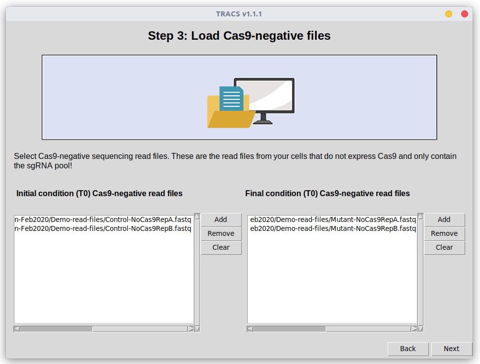
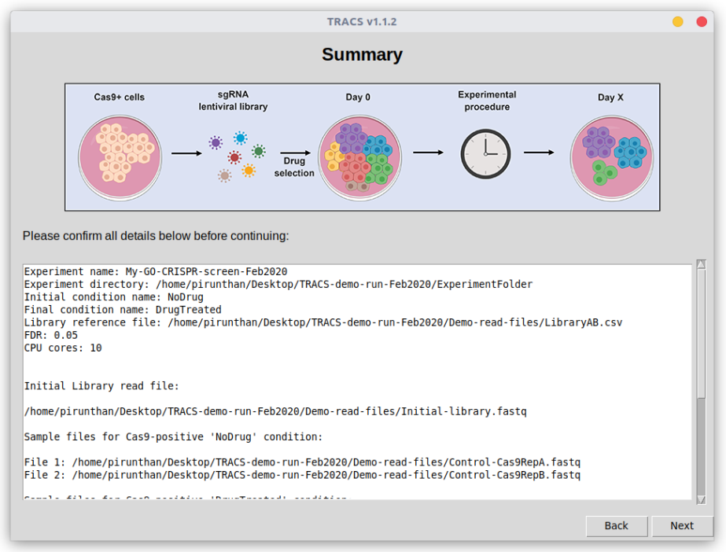

# TRACS
Toolset for Ranked Analysis of CRISPR Screens - a GUI tool to analyze CRISPR screens

# Table of contents
+ [Introduction](https://github.com/developerpiru/TRACS#introduction)
+ [Quick start guide](https://github.com/developerpiru/TRACS#quick-start-guide)
+ [Installation methods](https://github.com/developerpiru/TRACS#installation-methods)
	+ [Local machine or cloud\remote server (headless servers)](https://github.com/developerpiru/TRACS#local-machine-or-cloudremote-server-headless-servers)
	+ [Using TRACS natively or in a Docker container](https://github.com/developerpiru/TRACS#using-tracs-natively-or-in-a-docker-container)
	+ [Select your desired installation method](https://github.com/developerpiru/TRACS#select-your-desired-installation-method)
+ [Install on headless\remote\cloud server](https://github.com/developerpiru/TRACS#install-on-headlessremotecloud-server)
	+ [Automatically install VNC server on Ubuntu (may also work for Mac OS but untested)](https://github.com/developerpiru/TRACS#automatically-setting-up-vnc-server-on-ubuntu-may-also-work-for-mac-os-but-untested)
	+ [Install VNC client on your local computer](https://github.com/developerpiru/TRACS#install-vnc-client-on-your-local-computer)
	+ [Connecting to VNC server on remote server](https://github.com/developerpiru/TRACS#connecting-to-vnc-server-on-remote-server)
+ [Natively installing TRACS (currently only Linux and Mac OS are supported natively)](https://github.com/developerpiru/TRACS#natively-installing-tracs-currently-only-linux-and-mac-os-are-supported-natively)
	+ [Automatically install all required components](https://github.com/developerpiru/TRACS#automatically-install-all-required-components)
	+ [Start TRACS](https://github.com/developerpiru/TRACS#start-tracs)
+ [Using TRACS with Docker](https://github.com/developerpiru/TRACS#using-tracs-with-docker)
	+ [Docker on Windows](https://github.com/developerpiru/TRACS#docker-on-windows)
	+ [Docker on Mac OS](https://github.com/developerpiru/TRACS#docker-on-mac-os)
	+ [Docker on Linux](https://github.com/developerpiru/TRACS#docker-on-linux)
+ [Demo files](https://github.com/developerpiru/TRACS#demo-files)
+ [Analysis tutorial](https://github.com/developerpiru/TRACS#analysis-tutorial)
	+ [Step 1: Starting a new analysis](https://github.com/developerpiru/TRACS#step-1-starting-a-new-analysis)
	+ [Step 2: Loading library files and Cas9-positive read files](https://github.com/developerpiru/TRACS#step-2-loading-library-files-and-cas9-positive-read-files)
	+ [Step 3: Loading Cas9-negative read files](https://github.com/developerpiru/TRACS#step-3-loading-cas9-negative-read-files)
	+ [Step 4: Run TRACS analysis](https://github.com/developerpiru/TRACS#step-4-run-tracs-analysis)
	+ [Step 5: Data visualization and exploration](https://github.com/developerpiru/TRACS#step-5-data-visualization-and-exploration)
---

# Introduction
TRACS is a GUI (graphic user interface) based tool to analyze CRISPR screens. TRACS uses a ranking algorithm to identify sgRNAs and their respective genes that dropout or become enriched in experimental conditions. It requires you to provide sequencing data for a negative control conditon (cells tha do not express Cas9) and from the initial library preparation (plasmid preparation).

# Quick start guide

Here is a quick installation guide to get TRACS setup quickly if you don't want to read the detailed instructions:

1. Download the latest TRACS setup files here: https://github.com/developerpiru/TRACS/blob/master/Releases/
2. Extract the files:
	```
	unzip TRACSv1.1.1.zip
	```
	
	Where ```v1.1.1``` is the version number.
	
	***Note:*** if you don't have ```unzip``` installed, you can install it using this command:
	```
	sudo apt-get update
	sudo apt install unzip
	```
3. Change the permissions of the ```setup.sh``` script so it is executable:
	```
	sudo chmod +x setup.sh
	```
4. Run the script:
	```
	bash setup.sh
	```

	***Optional:*** if you are install on a headless remote Linux server without a desktop interface configured, you must install a desktop environment and install VNC server so you can connect to it:
	+ Change the permissions of the ```vnc-setup.sh``` script so it is executable:
		```
		sudo chmod +x vnc-server.sh
		```
	+ Run the script:
		```
		bash vnc-setup.sh
		```
	+ Start VNC server
		```
		vncserver -geometry 1200x1050
		```
	+ Connect to your server using a VNC client
5. Nagvigate to the folder where you extracted TRACS in step 2.

6. Enter this command to start TRACS:
	```
	python3 TRACS.py
	```

# Installation methods
There are several ways to install TRACS and each one is covered below. TRACS is written in Python 3.6 so will run on any operating system with Python 3.6+ installed, incluing Windows, Linux, and Mac OS. However, it relies on several dependencies which are not currently available on Windows. While this means (for the time being) you cannnot run TRACS natively on Windows, you can still use [Docker](https://www.docker.com/get-started) (or other VM solution).

Please see the instructions below for your operating system for the best way to get started.

## Local machine or cloud\remote server (headless servers)
First you need to decide if you will run TRACS on a **local machine** with access to its GUI desktop, or if you will use a **headless\remote\cloud server**. If you plan on running TRACS on a remote\cloud server running Linux, you will first need to setup its GUI desktop in order to use TRACS. This is a one time setup process. You can also use a remote Windows or Mac OS cloud server.


As with any high-throughput sequencing analysis method, the more powerful the computer, the faster TRACS tasks will complete. We therefore recommend the use of cloud servers whenever possible, such as [Amazon AWS](https://aws.amazon.com/), [Google Cloud Platform (GCP)](https://cloud.google.com/), or [Microsoft Azure](https://azure.microsoft.com/). You may also use [Mac in Cloud](https://www.macincloud.com/), [XCloud](https://xcloud.me/), or [MacStadium](https://www.macstadium.com/) for Mac OS cloud servers.

A Linux server running Ubuntu 18.04 LTS is recommended for AWS, GCP, Azure, or other Linux VM cloud provider. If you are unfamiliar with Linux, you can also use a Windows 10 Pro instance on Azure and install TRACS using Docker. In Azure, select a [Dv3 or Ev3 based VM which support Nested Virtualization](https://azure.microsoft.com/en-us/blog/introducing-the-new-dv3-and-ev3-vm-sizes/) so that you can use Docker. At this time, AWS does not support Nested Virtualization while [GCP supports it on Linux only](https://cloud.google.com/compute/docs/instances/enable-nested-virtualization-vm-instances).

**Note:** Nested Virtualization is only required to run Linux-based Docker containers in a Linux VM. So if you want to do this, use Azure.


## Using TRACS natively or in a Docker container
Secondly, you need to decide whether you will run **TRACS natively** on your local or remote server, or if you will run it inside a **Docker container** (a VM instance). Our Docker container provides a ready-to-go virtual instance with TRACS and all of its required components installed. All you have to do is download and build the container (a one time step). Of course, you must have [Docker](https://www.docker.com/get-started) installed. This will allow you to run TRACS on Windows, Linux, or Mac OS.


You can also install TRACS natively without the need for Docker in Linux and Mac OS. To do this, you must have Python 3.6+ installed, along with Bowtie2, Cutadapt, and MAGeCK 0.5.5.

---
## Select your desired installation method
+ Install on headless\remote\cloud server
	+ [Install Remote Desktop or VNC server & client](https://github.com/developerpiru/TRACS#install-on-headlessremotecloud-server)
	+ [Install TRACS natively](https://github.com/developerpiru/TRACS#natively-installing-tracs-currently-only-linux-and-mac-os-are-supported-natively) or [install TRACS Docker container](https://github.com/developerpiru/TRACS#using-tracs-with-docker)
+ Install on local computer
	+ [Install TRACS natively](https://github.com/developerpiru/TRACS#natively-installing-tracs-currently-only-linux-and-mac-os-are-supported-natively) or [Install TRACS Docker container](https://github.com/developerpiru/TRACS#using-tracs-with-docker)
---

# Install on headless\remote\cloud server

You must first connect to your server's GUI desktop. If you are using a Windows server (Windows 10 or any Windows Server OS), you can connect to it using Remote Desktop Connection from any host Windows OS and you will see the desktop automatically. If you are using a Mac OS server, you can you can install the Microsoft Remote Desktop App through the App Store to connect to a remote Mac OS or Windows server. Alternatively, you may follow the instructions below to setup VNC on your Mac OS server. If you are connecting to a Linux server, you must first ssh into your server and setup a VNC server as described below.

If you are using a Linux server, chances are it is currently only configured for ssh\terminal access. Since TRACS is a GUI program, it is critical that you have an X window system setup on your Linux server. **If you already have this setup and you can connect to the Linux desktop using VNC, you can skip this part and proceed to the instructions for installing TRACS natively.**

## Automatically install VNC server on Ubuntu (may also work for Mac OS but untested)

We have now created a bash shell script that will configure your Linux server with a GUI desktop. Follow the instructions below to do this automatically. 

1. Download the latest TRACS setup files here: https://github.com/developerpiru/TRACS/blob/master/Releases/
2. Extract the files:
	```
	unzip TRACSv1.1.1.zip
	```
	
	Where ```v1.1.1``` is the version number.
	
	***Note:*** if you don't have ```unzip``` installed, you can install it using this command:
	```
	sudo apt-get update
	sudo apt install unzip
	```
3. Change the permissions of the ```vnc-setup.sh``` script so it is executable:
	```
	sudo chmod +x vnc-setup.sh
	```
4. Run the script:
	```
	bash vnc-setup.sh
	```

You may now follow the instructions below to [install VNC client on your local computer](https://github.com/developerpiru/TRACS#install-vnc-client-on-your-local-computer) so you can connect to your remote server.
	
## Install VNC client on your local computer
You need a VNC client to connect to the VNC server you just setup on your remote server. 

You can install either PuTTY for Windows (https://www.chiark.greenend.org.uk/~sgtatham/putty/latest.html) or RealVNC's VNC Viewer for Windows, Mac OS, or Linux (https://www.realvnc.com/en/connect/download/viewer/)

See below for instructions on how to connect to your remote server.

## Connecting to VNC server on remote server
1. Start the VNC server with this command on your remote server:
	```
	vncserver -geometry 1200x1050
	```
	**Note:** the `-geometry 1200x1050` flag is optional and you can customize it to any resolution you prefer

2. Open your VNC client (PuTTY or VNC Viewer) and enter the **external IP address** (not its local IP!) of your remote computer followed by the `:5901` port. For example: `192.0.2.0:5901`
	
3. Enter the password you created earlier when prompted.

You should now see the Ubuntu desktop now and be able to interact with the GUI using your mouse and keyboard. 

You are now connected to your remote server's desktop interface and can continue with the installation for TRACS either [natively](https://github.com/developerpiru/TRACS#natively-installing-tracs-currently-only-linux-and-mac-os-are-supported-natively) or [using Docker](https://github.com/developerpiru/TRACS#using-tracs-with-docker).

**Note:** to help you with downloading required components, it is recommended that you install Chrome or Firefox on your Linux server:

Chrome:
	
	wget https://dl.google.com/linux/direct/google-chrome-stable_current_amd64.deb
	sudo dpkg -i google-chrome-stable_current_amd64.deb
	
	
Firefox:
	
	sudo apt-get update
	sudo apt-get install firefox
	

#### Stopping the VNC server
You can stop the VNC server using this command:
	
	vncserver -kill :1
	
---
## Natively installing TRACS (currently only Linux and Mac OS are supported natively)

Once you can connect to your remote server's GUI desktop, or if you are installing TRACS on a local machine, you can proceed with the following instructions to install TRACS natively. If you'd like to install TRACS in a Docker container instead, [please see these instructions](https://github.com/developerpiru/TRACS#using-tracs-with-docker). Docker containers provide a Linux VM instance with everything configured and ready to go so you can start using TRACS quickly. 

### Automatically install all required components

We have created a bash shell script that will automatically configure your computer with all of the required components with minimal user input. 

1. Download the latest TRACS setup files here: https://github.com/developerpiru/TRACS/blob/master/Releases/
2. Extract the files:
	```
	unzip TRACSv1.1.1.zip
	```
	
	Where ```v1.1.1``` is the version number.
	
	***Note:*** if you don't have ```unzip``` installed, you can install it using this command:
	```
	sudo apt-get update
	sudo apt install unzip
	```
3. Change the permissions of the ```setup.sh``` script so it is executable:
	```
	sudo chmod +x setup.sh
	```
4. Run the script:
	```
	bash setup.sh
	```

This will install Python 3 including all of the required Python libraries () and other components (cutadapt, bowtie, samtools, mageck count function).

### Start TRACS
Once you have all of the requirement components installed, you are ready to install TRACS!

1. Access the desktop of your Linux or Mac OS device. You need to connect remotely to the desktop if you are using a remote\cloud server ([see instructions above](https://github.com/developerpiru/TRACS#install-vnc-client-on-your-local-computer)).

2. Open a Terminal window and nagvigate to the folder where you extracted TRACS.

5. Enter this command to start TRACS:
	```
	python3 TRACS.py
	```
---
## Using TRACS with Docker

Connect to the desktop of your Windows, Linux or Mac OS device. You need to connect remotely to the desktop if you are using a remote\cloud server ([see instructions above](https://github.com/developerpiru/TRACS#install-on-headlessremotecloud-server)).

- [Docker on Windows](https://github.com/developerpiru/TRACS#docker-on-windows)
- [Docker on Mac OS](https://github.com/developerpiru/TRACS#docker-on-mac-os)
- [Docker on Linux](https://github.com/developerpiru/TRACS#docker-on-linux)

### Docker on Windows
#### Installation
1. Download and install Docker Desktop for Windows 10 Pro\Enterprise here: https://www.docker.com/products/docker-desktop

	If you have an older version of Windows (or Windows 10 Home) you will need to install Docker Toolbox: https://docs.docker.com/toolbox/toolbox_install_windows/

	**Note:** you may have to sign up for free with Docker before you can download.

	Follow the instructions on the respective Docker pages for installing Docker and getting it running.

2. Download and install XMing X Server for Windows: https://sourceforge.net/projects/xming/
	
	Install with the default options.

3. Download the [TRACS-docker-container-win.zip](TRACS-Docker-setup/TRACS-docker-container-win.zip) file located in the TRACS-Docker-Setup folder on our github repository. 
	
	This contains the TRACS Dockerfile, XMing configuration, and Windows PowerShell scripts to automate setup and launching TRACS. 

4. Extract the TRACS-docker-container folder to ```C:\``` (note if you change this location, you will need to modify the PowerShell scripts accordingly).

5. Right click the "Build TRACS Container.ps1" file and click "Run with PowerShell". 
	Wait for the process to complete; it may take several minutes. 
	
#### Launching TRACS Docker container on Windows
Right click the "Run TRACS Container - with XLaunch.ps1" file and click "Run with PowerShell". 
Approve the Windows access control prompt if necessary and approve the sharing of your local ```C:\``` if prompted by Docker.

TRACS will launch in a Docker container and mount your local ```C:\``` drive at ```/app/TRACS/cdrive/``` in the Docker container so you can transport files from the container to your local drive. 

**IMPORTANT!:** As with any Docker container, anything you DO NOT save in ```/app/TRACS/cdrive/``` will be lost when you exit TRACS!

---
### Docker on Mac OS
#### Installation
1. Download and install Docker Desktop for Mac OS here: https://www.docker.com/products/docker-desktop

	If you have an older version of Mac OS  you will need to install Docker Toolbox: https://docs.docker.com/toolbox/toolbox_install_mac/

	**Note:** you may have to sign up for free with Docker before you can download.

	Follow the instructions on the respective Docker pages for installing Docker and getting it running.

2. Download and install XQuartz for Mac OS: https://www.xquartz.org/
	
	Install with the default options.

3. Start XQuartz and go to Preferences > Security and check option to allow connections from network clients. 
	
	Exit XQuartz.

4. Download the [TRACS-docker-container-mac.zip](TRACS-Docker-setup/TRACS-docker-container-mac.zip) file located in the TRACS-Docker-Setup folder on our github repository. 
	
	This contains the TRACS Dockerfile, XMing configuration, and Windows PowerShell scripts to automate setup and launching TRACS. 

5. Extract the TRACS-docker-container folder to anywhere you desire.

6. Double click the "Build-TRACS" file to start building the TRACS Docker container.

#### Launching TRACS Docker container on Mac OS
Double click the "Start-TRACS" file to start the Docker container and launch TRACS. 

TRACS will launch in a Docker container and mount your local drives (```/Volumes```) at ```/app/TRACS/LocalDrives/``` in the Docker container so you can transport files from the container to your local drive. 

**IMPORTANT!:** As with any Docker container, anything you DO NOT save in ```/app/TRACS/LocalDrives/``` will be lost when you exit TRACS!

---
### Docker on Linux
#### Installation
1. Install Docker for Linux (Ubuntu):
	```
	sudo apt-get update
	sudo apt-get install docker.io
	```
	
2. Start Docker:
	```
	sudo systemctl start docker
	sudo systemctl enable docker
	
	```
3. Download the [TRACS-docker-container-linux.zip](TRACS-Docker-setup/TRACS-docker-container-linux.zip) file located in the TRACS-Docker-Setup folder on our github repository. 

4. Extract the TRACS-docker-container folder to anywhere you desire:
	```
	unzip TRACS-docker-container-linux.zip
	```

5. Navigate to the folder and build the TRACS Docker container:
	```
	cd TRACS-docker-container
	docker build -t tracs .
	```
	
#### Launching TRACS Docker container on Linux
Open a terminal window and enter this command to start the TRACS container:

	docker run -ti --rm -e DISPLAY=$DISPLAY -v /tmp/.X11-unix:/tmp/.X11-unix ubuntu -v /path/to/folder:/app/TRACS/sharedfolder tracs

			
Where ```/path/to/folder``` is your local drive/folder that you want to make available to the TRACS container.
	
For example:
	
	docker run -ti --rm -e DISPLAY=$DISPLAY -v /tmp/.X11-unix:/tmp/.X11-unix ubuntu -v $HOME/:/app/TRACS/sharedfolder tracs
	

TRACS will launch in a Docker container and mount your local drive or folder (```/path/to/folder```) at ```/app/TRACS/sharedfolder/``` in the Docker container so you can transport files from the container to your local drive.

**IMPORTANT!:** As with any Docker container, anything you DO NOT save in ```/app/TRACS/sharedfolder/``` will be lost when you exit TRACS!

---

# Demo files

Check the [Demo-files.md](Demo-files.md) file for information on how to download some demo files for testing TRACS.

---

# Analysis tutorial

Here we will walk through the steps to run a typical analysis using TRACS. This assumes you have already installed and launched TRACS using one of the methods described above in the [Installation methods](https://github.com/developerpiru/TRACS#installation-methods) section.

You can download some [demo files](https://github.com/developerpiru/TRACS#demo-files) above to test out TRACS and follow along.

A typical analysis can take 2-6 hours (or more) depending on how powerful your computer/server is, the number of samples you have, and the sequencing depth/number of reads. However, once you select all of your files and start the process, TRACS does everything automatically so you don't need to monitor it.

## Step 1: Starting a new analysis

1. Follow the instructions above to install and launch TRACS according to your desired method.
2. In the main TRACS window, click on ```Start New Experiment```.
3. You will be presented with Step 1 of the experiment wizard shown below:
	
4. Here you need to define the following:
	+ ```Experiment name```: Enter an identifying name for your project. All of the files created by TRACS will have this name as the prefix.
	+ ```Experiment directory```: Entire a folder to store all of the files created by TRACS. It is recommended that you make a new folder to keep things organized. TRACS will create subdirectories and files within this main folder.
	+ ```Name of initial condition (T0)```: Enter a name for your initial condition at time T0 (e.g. Initial, Adherent, Time_0hr, DMSO). This will be used as the column prefix for all initial condition (T0) samples. Do not use spaces!
	+ ```Name of final condition (Tf)```: Enter a name for your final condition at time Tf (e.g. Final, Spheroids, Time_48hr, Drug_treated). This will be used as the column prefix for all final condition (Tf) samples. Do not use spaces!
	+ ```False discovery rate (FDR)```: Enter a false discovery rate as a decimal fraction. The default is 0.05 for 5%.
	
5. Cick ```Next``` to continue.

## Step 2: Loading library files and Cas9-positive read files

6. You will then be presented with the next step of the wizard:
	
7. Here you must provide the following:
	+ ```Library reference file (CSV)```: This is the reference file in csv (comma-delimited) format containing all of the sgRNA IDs and sequences for your pooled sgRNA library. For the GeCKO v2 library, you can download this from our GitHub repository in the [```Resources```](Resources/) folder.
	+ ```Initial library (L0) read file (FASTQ)```: This is the sequencing read file of your initial pooled sgRNA library (L0). 
	+ ```Initial condition (T0) Cas9-positive read files```: Here you select load all of the read files for your Cas9-positive initial condition samples. Use the ```Add``` button to open the file selection dialog. You can select multiple files at once. Use the ```Remove``` or ```Clear``` buttons to remove files.
	
	+ ```Final condition (Tf) Cas9-positive read files```: Here you select load all of the read files for your Cas9-positive final condition samples.

8. Cick ```Next``` to continue.

## Step 3: Loading Cas9-negative read files

9. You will then be presented with step 3 of the wizard:
	
10. Here you must load the sequencing read files (FASTQ) for your Cas9-negative samples:
	+ ```Initial condition (T0) Cas9-negative read files```: Select all of the read files for your Cas9-negative guide-only initial condition samples.
	+ ```Final condition (T0) Cas9-negative read files```: Select all of the read files for your Cas9-negative guide-only final condition samples.

11. Cick ```Next``` to continue.

12. You will then be shown a Summary page where you can confirm all of the details and files you entered:
	

13. Cick ```Next``` to continue or use the ```Back``` button to go to any previous steps and fix any errors.

## Step 4: Run TRACS analysis

14. You will then be presented with the next step with the following prompt:
	
15. As shown in the screenshot above, you have two options to continue with analysis:
	+ Option 1: This will be the most common option especially if you are running a new analysis. If you have raw read files (FASTQ) for each sample and have not yet run TRACS, then this is the option you want to select. It will:
		+ Trim your reads to remove junk sequences surrounding the sgRNA sequence barcodes
		+ Build a reference library using library reference (CSV) file you provided in step 2.
		+ Perform alignments of your raw reads to the library
		+ Generate read counts from the alignments
		+ Run the TRACS algorithm to determine gene essentiality
	+ Option 2: If you have **already** run TRACS for the samples you have selected once before, **and** you have selected all of the same samples, entered the experiment name, experiment folder, and the initial and final condition names correctly, then you can skip most of the pre-processing steps before running the TRACS algorithm. This option will use the read counts file that TRACS previously created (located at ```ExperimentDirectory/readcounts/ExperimentName.count.txt```) and only run the TRACS algorithm to determine gene essentiality.

16. Select option 1 or 2 by clicking on the respective buttons:
	+ ```1. I have raw read files (FASTQ files). Do everything for me!```
	+ ```2. I already have a read counts file (TXT). Just give me the essential genes!```

17. TRACS will then automatically run all of the necessary steps without any further interaction from you! This may take a few hours depending on the performance of your computer, the number of samples you have, and the sequencing depth (number of reads per sample).

You can monitor the progress using the command line/terminal window. You should see status updates during the pre-processing steps (trimming, alignment, read count generation). The final status output will look like this upon successful completion:


18. Your experiment folder will now contain the following files and folders:
	

Notice the different folders that are created by each of the pre-processing steps. **Note:** do not modify the contents of these folders in case you want to run TRACS again using option 2, as described above.

Notice that each of the files are prefixed using the ```Experiment name``` entered in step 1. Most of these files are created by intermediate steps by TRACS. The final data output file you want to use for further analysis, data visualization, and data exploration is the one named ```[ExperimentName].csv```. This file contains all of the Enrichment Scores (Library ES, Initial ES, Final ES), the Enrichment Ratio (ER), and the statistical values (p values and q values). 

## Step 5: Data visualization and exploration

You can visualize the data in your ```[ExperimentName].csv``` TRACS output file using the companion app called [VisualizeTRACS](https://github.com/developerpiru/VisualizeTRACS), which is an R shiny app. Unlike TRACS, you do not need to have a powerful computer to run VisualizeTRACS - this means you can download the ```[ExperimentName].csv``` file from a cloud server (if you used one) and do the visualization steps locally. 
